---
# Front matter
lang: ru-RU
title: "Лабораторная работа №1"
subtitle: "Установка и конфигурация операционной системы на виртуальную машину"
author: "Ишанова А.И. группа НФИ-02-19"

# Formatting
toc-title: "Содержание"

# Pdf output format
toc: true # Table of contents
toc_depth: 2
lof: true # List of figures
lot: false # List of tables
fontsize: 12pt
linestretch: 1.5
papersize: a4
documentclass: scrreprt
## I18n
polyglossia-lang:
  name: russian
  options:
	- spelling=modern
	- babelshorthands=true
polyglossia-otherlangs:
  name: english
### Fonts
mainfont: PT Serif
romanfont: PT Serif
sansfont: PT Sans
monofont: PT Mono
mainfontoptions: Ligatures=TeX
romanfontoptions: Ligatures=TeX
sansfontoptions: Ligatures=TeX,Scale=MatchLowercase
monofontoptions: Scale=MatchLowercase,Scale=0.9
## Biblatex
biblatex: true
biblio-style: "gost-numeric"
biblatexoptions:
  - parentracker=true
  - backend=biber
  - hyperref=auto
  - language=auto
  - autolang=other*
  - citestyle=gost-numeric
## Misc options
indent: true
header-includes:
  - \linepenalty=10 # the penalty added to the badness of each line within a paragraph (no associated penalty node) Increasing the value makes tex try to have fewer lines in the paragraph.
  - \interlinepenalty=0 # value of the penalty (node) added after each line of a paragraph.
  - \hyphenpenalty=50 # the penalty for line breaking at an automatically inserted hyphen
  - \exhyphenpenalty=50 # the penalty for line breaking at an explicit hyphen
  - \binoppenalty=700 # the penalty for breaking a line at a binary operator
  - \relpenalty=500 # the penalty for breaking a line at a relation
  - \clubpenalty=150 # extra penalty for breaking after first line of a paragraph
  - \widowpenalty=150 # extra penalty for breaking before last line of a paragraph
  - \displaywidowpenalty=50 # extra penalty for breaking before last line before a display math
  - \brokenpenalty=100 # extra penalty for page breaking after a hyphenated line
  - \predisplaypenalty=10000 # penalty for breaking before a display
  - \postdisplaypenalty=0 # penalty for breaking after a display
  - \floatingpenalty = 20000 # penalty for splitting an insertion (can only be split footnote in standard LaTeX)
  - \raggedbottom # or \flushbottom
  - \usepackage{float} # keep figures where there are in the text
  - \floatplacement{figure}{H} # keep figures where there are in the text
---

# Цель работы

Установка ОС на Virtual Box для дальнейшего использования в ходе прохождения курса.

# Задание

1. Установить ОС на Virtual Box.
2. Получите следующую информацию.
   1. Версия ядра Linux (Linux version).
   2. Частота процессора (Detected Mhz processor).
   3. Модель процессора (CPU0).
   4. Объем доступной оперативной памяти (Memory available).
   5. Тип обнаруженного гипервизора (Hypervisor detected).
   6. Тип файловой системы корневого раздела.
   7. Последовательность монтирования файловых систем. [1]

# Теоретическое введение

Виртуальная машина (VM, от англ. virtual machine) — программная и/или аппаратная система, эмулирующая аппаратное обеспечение некоторой платформы (guest — гостевая платформа) и исполняющая программы для guest-платформы на host-платформе (host — хост-платформа, платформа-хозяин) или виртуализирующая некоторую платформу и создающая на ней среды, изолирующие друг от друга программы и даже операционные системы; также спецификация некоторой вычислительной среды. [2]

VirtualBox (Oracle VM VirtualBox) — программный продукт виртуализации для операционных систем Windows, Linux, FreeBSD, macOS, Solaris/OpenSolaris, ReactOS, DOS и других. [3]

# Выполнение лабораторной работы

## Установка ОС

Предварительно были скачаны Virtual Box (и установлена) и дистрибутив Rocky.

1. Создаем новую виртуальную машину. (@fig:001)

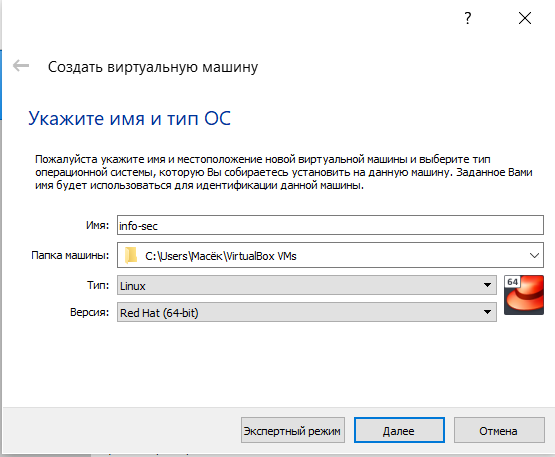{ #fig:001 width=80%}

2. Настариваем. (@fig:002 - @fig:006)

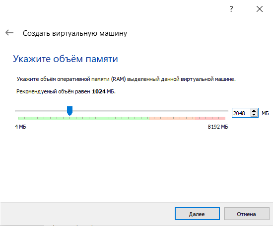{ #fig:002 width=70%}

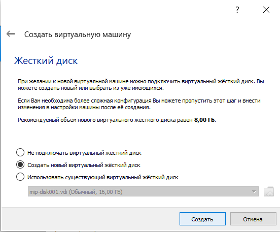{ #fig:003 width=70%}

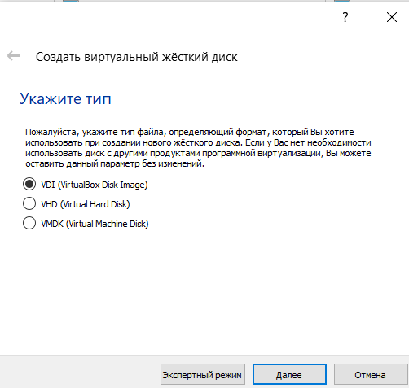{ #fig:004 width=70%}

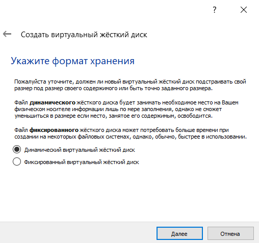{ #fig:005 width=70%}

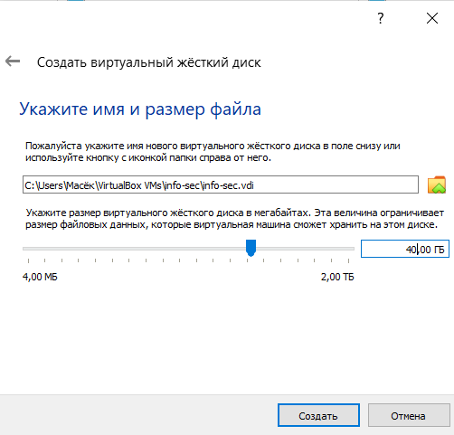{ #fig:006 width=70%}

3. В настройках виртуальной машины в носители ставим дистрибутив Linux. (@fig:007)

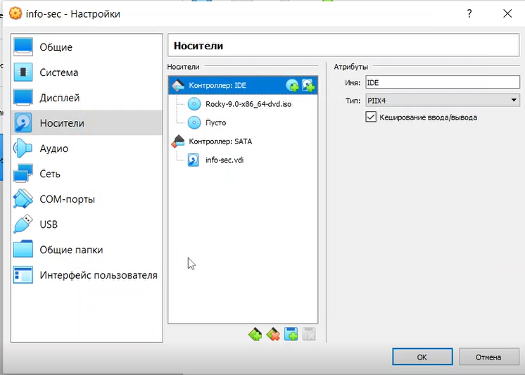{ #fig:007 width=80%}

4. Запускаем вируальную машину. Ставим параметры установки и устанавливаем ОС. (@fig:008 - @fig:015)

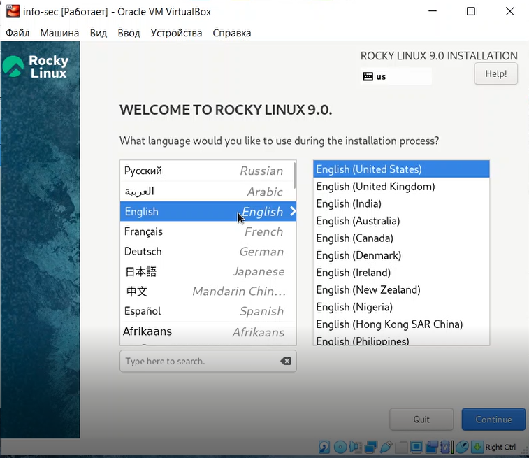{ #fig:008 width=80%}

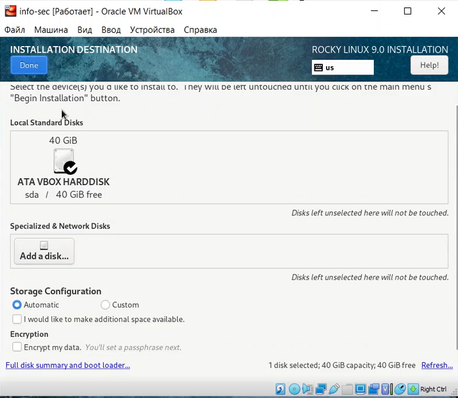{ #fig:009 width=80%}

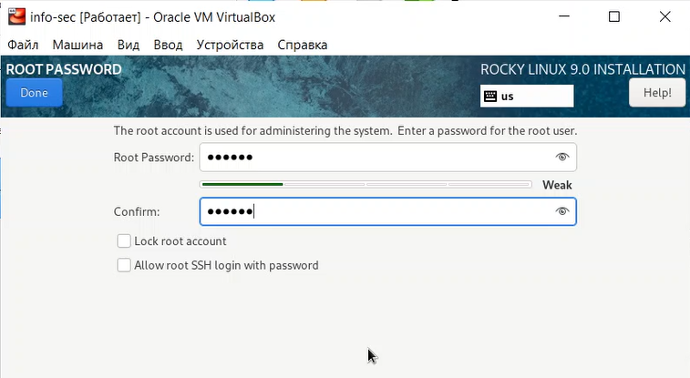{ #fig:010 width=80%}

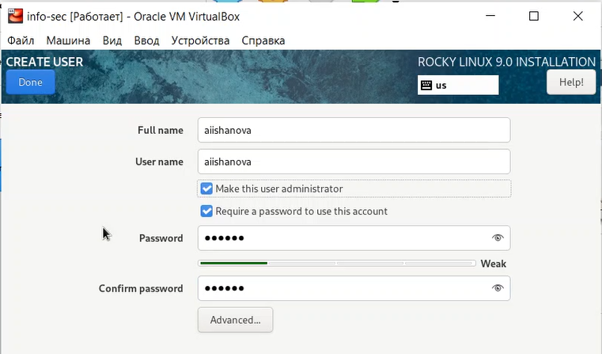{ #fig:011 width=80%}

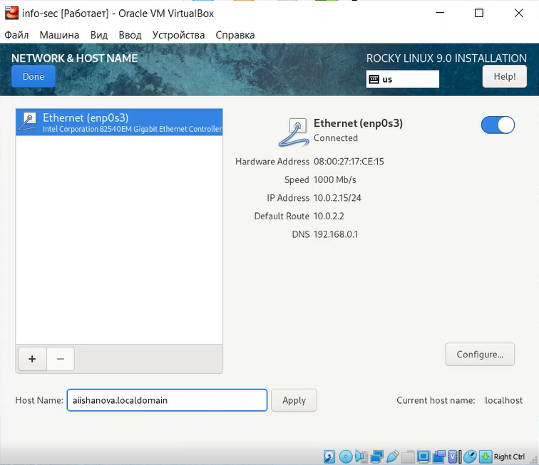{ #fig:012 width=80%}

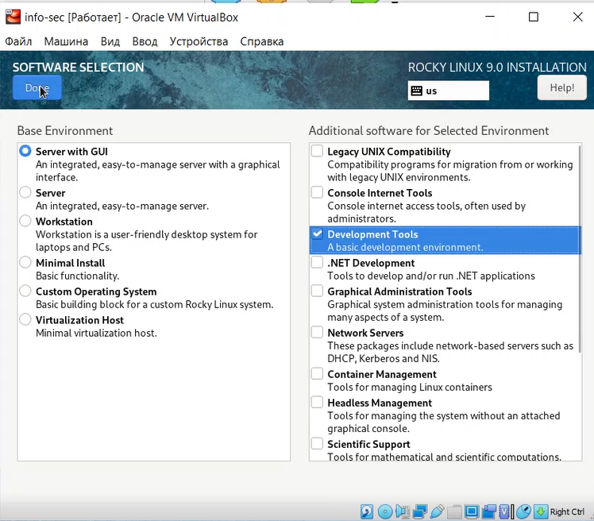{ #fig:013 width=80%}

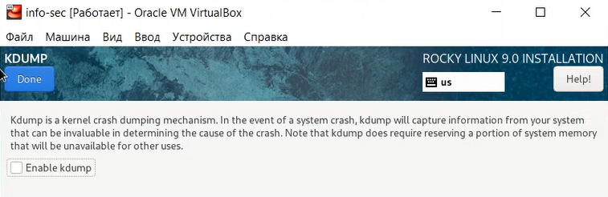{ #fig:014 width=80%}

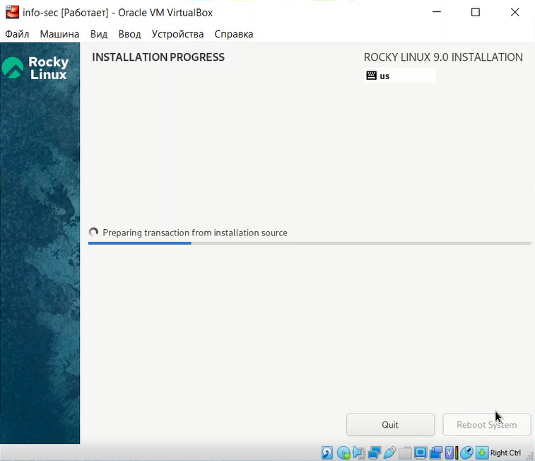{ #fig:015 width=80%}

## Поиск информации через терминал

1. Перезагружаем виртуальную машину после установки. Открывваем терминал. Применяем команды dmesg и dmesg | less. (@fig:016 - @fig:017)

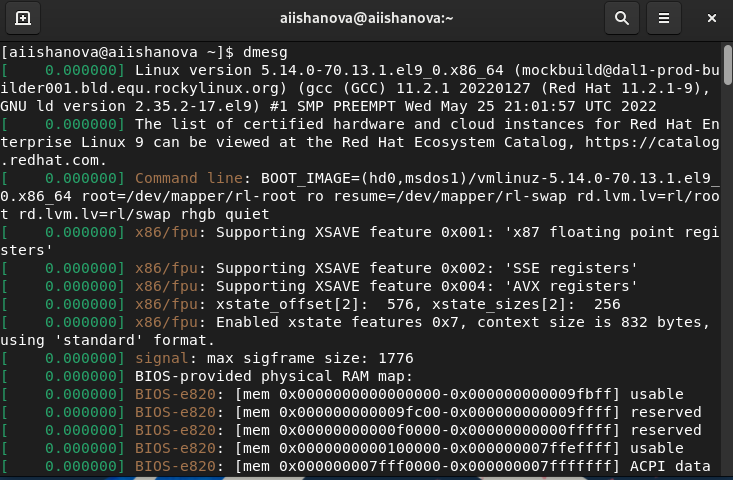{ #fig:016 width=100%}

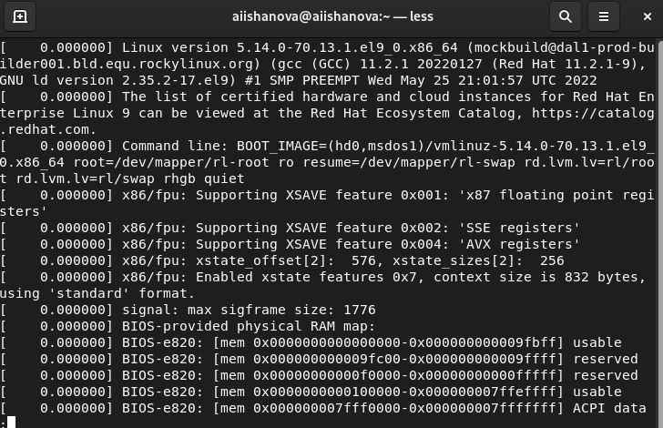{ #fig:017 width=80%}

2. Начинаем поиск информации с помощью команд grep | -i "ключевое слово". (@fig:018 - @fig:019)

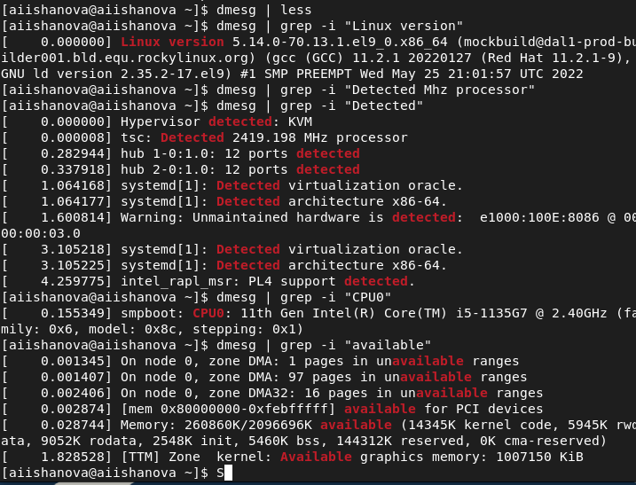{ #fig:018 width=80%}

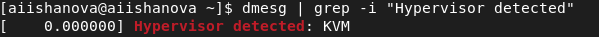{ #fig:019 width=80%}

3. Для поиска информации о файловых системах используем команды df -Th и findmnt. (@fig:020)

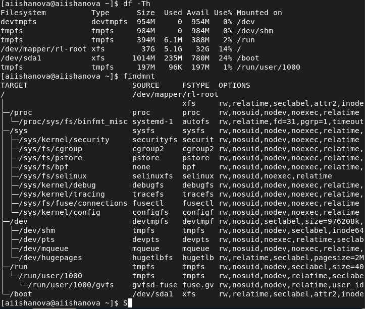{ #fig:020 width=80%}

# Вывод

В ходе выполнения лабораторной работы была установлена новая ОС на новую виртуальную машину. Так была найдена следующая информация:

- версия ядра Linux 5.14.0-70.13.1.el0_0.x86_64
- частота процессора 2419.198 МГц
- модель процессора 11th Gen Intel(R) Core(TM) i5-1135G7 @ 2.40Ghz
- обьем доступной оперативной памяти 260860К/20966969К
- тип обнаруженного гипервизора KVM
- тип файловой системы корневого раздела xfs
- последовательность монтирования файловых систем

# Библиография

1. Методические материалы курса.
2. Wikipedia: Виртуальная машина. (https://ru.wikipedia.org/wiki/%D0%92%D0%B8%D1%80%D1%82%D1%83%D0%B0%D0%BB%D1%8C%D0%BD%D0%B0%D1%8F_%D0%BC%D0%B0%D1%88%D0%B8%D0%BD%D0%B0)
3. Wikipedia: Virtual Box. (https://ru.wikipedia.org/wiki/VirtualBox)
