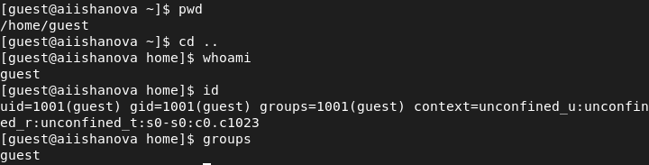

---
# Front matter
lang: ru-RU
title: "Лабораторная работа №2"
subtitle: "Дискреционное разграничение прав в Linux. Основные атрибуты."
author: "Ишанова А.И. группа НФИ-02-19"

# Formatting
toc-title: "Содержание"

# Pdf output format
toc: true # Table of contents
toc_depth: 2
lof: true # List of figures
lot: false # List of tables
fontsize: 12pt
linestretch: 1.5
papersize: a4
documentclass: scrreprt
## I18n
polyglossia-lang:
  name: russian
  options:
	- spelling=modern
	- babelshorthands=true
polyglossia-otherlangs:
  name: english
### Fonts
mainfont: PT Serif
romanfont: PT Serif
sansfont: PT Sans
monofont: PT Mono
mainfontoptions: Ligatures=TeX
romanfontoptions: Ligatures=TeX
sansfontoptions: Ligatures=TeX,Scale=MatchLowercase
monofontoptions: Scale=MatchLowercase,Scale=0.9
## Biblatex
biblatex: true
biblio-style: "gost-numeric"
biblatexoptions:
  - parentracker=true
  - backend=biber
  - hyperref=auto
  - language=auto
  - autolang=other*
  - citestyle=gost-numeric
## Misc options
indent: true
header-includes:
  - \linepenalty=10 # the penalty added to the badness of each line within a paragraph (no associated penalty node) Increasing the value makes tex try to have fewer lines in the paragraph.
  - \interlinepenalty=0 # value of the penalty (node) added after each line of a paragraph.
  - \hyphenpenalty=50 # the penalty for line breaking at an automatically inserted hyphen
  - \exhyphenpenalty=50 # the penalty for line breaking at an explicit hyphen
  - \binoppenalty=700 # the penalty for breaking a line at a binary operator
  - \relpenalty=500 # the penalty for breaking a line at a relation
  - \clubpenalty=150 # extra penalty for breaking after first line of a paragraph
  - \widowpenalty=150 # extra penalty for breaking before last line of a paragraph
  - \displaywidowpenalty=50 # extra penalty for breaking before last line before a display math
  - \brokenpenalty=100 # extra penalty for page breaking after a hyphenated line
  - \predisplaypenalty=10000 # penalty for breaking before a display
  - \postdisplaypenalty=0 # penalty for breaking after a display
  - \floatingpenalty = 20000 # penalty for splitting an insertion (can only be split footnote in standard LaTeX)
  - \raggedbottom # or \flushbottom
  - \usepackage{float} # keep figures where there are in the text
  - \floatplacement{figure}{H} # keep figures where there are in the text
---

# Цель работы

Получение практических навыков работы в консоли с атрибутами файлов, закрепление теоретических основ дискреционного разграничения доступа в современных системах с открытым кодом на базе ОС Linux.

# Теоретическое введение

Дискреционное разграничение доступа — управление доступом субъектов к объектам на основе списков управления доступом или матрицы доступа. Также используются названия дискреционное управление доступом, контролируемое управление доступом и разграничительное управление доступом. [2]

# Выполнение лабораторной работы

1. Создаем учетную запись пользлвателя guest. (@fig:001)

{ #fig:001 width=100%}

2. Задаем пароль для новой учетной записи.(@fig:002)

{ #fig:002 width=100%}

3. Входим в новую учетную запись. Определяем директорию в которой находимся. Она не является домашней директорией, переходим в нее. (@fig:003)

4. Уточняем имя пользователя. (@fig:003)

5. Уточняем имя пользователя и его группу. Guest ходится с командной строкой. (@fig:003)

{ #fig:003 width=100%}

6. Смотрим файл /etc/passwd. (@fig:004 - @fig:005)

{ #fig:004 width=100%}

{ #fig:005 width=100%}

7. Определяем существующие в системе директории. (@fig:006)

{ #fig:006 width=100%}

8. Смотрим расширенные атрибуты установлены на поддиректориях, находящихся в директории /home. (@fig:007)

{ #fig:007 width=100%}

9. Создаем поддиректорию dir1 и определяем права доступа и расширенные атрибуты. (@fig:008)

{ #fig:008 width=100%}

10. Снимаем все атрибуты поддиректории. (@fig:009)

{ #fig:009 width=100%}

11. Пытаемся создать файл, не получается из-за запрета доступа. (@fig:010)

{ #fig:010 width=100%}

12. Заполняем таблицу "Установленные права и разрешённые действия".

|Права директории|Права файла|Создание файла|Удаление файла|Запись в файл|Чтение файла|Смена директории|Просмотр файлов в директории|Переименование файла|Смена атрибутов файла|
|:-------: |:------:| :------:| :------:| :------:| :------:| :------:| :------:| :------:| :------:|
| d(000) | 000 | - | - | - | - | - | - | - | - |
| d(000) | 100 | - | - | - | - | - | - | - | - |
| d(000) | 200 | - | - | - | - | - | - | - | - |
| d(000) | 300 | - | - | - | - | - | - | - | - |
| d(000) | 400 | - | - | - | - | - | - | - | - |
| d(000) | 500 | - | - | - | - | - | - | - | - |
| d(000) | 600 | - | - | - | - | - | - | - | - |
| d(000) | 700 | - | - | - | - | - | - | - | - |
| d(100) | 000 | - | - | - | - | + | - | - | - |
| d(100) | 100 | - | - | - | - | + | - | - | - |
| d(100) | 200 | - | - | + | - | + | - | - | - |
| d(100) | 300 | - | - | + | - | + | - | - | - |
| d(100) | 400 | - | - | - | + | + | - | - | - |
| d(100) | 500 | - | - | - | + | + | - | - | - |
| d(100) | 600 | - | - | + | + | + | - | - | - |
| d(100) | 700 | - | - | + | + | + | - | - | - |
| d(200) | 000 | - | - | - | - | - | - | - | - |
| d(200) | 100 | - | - | - | - | - | - | - | - |
| d(200) | 200 | - | - | - | - | - | - | - | - |
| d(200) | 300 | - | - | - | - | - | - | - | - |
| d(200) | 400 | - | - | - | - | - | - | - | - |
| d(200) | 500 | - | - | - | - | - | - | - | - |
| d(200) | 600 | - | - | - | - | - | - | - | - |
| d(200) | 700 | - | - | - | - | - | - | - | - |
| d(300) | 000 | + | + | - | - | + | - | + | + |
| d(300) | 100 | + | + | - | - | + | - | + | + |
| d(300) | 200 | + | + | + | - | + | - | + | + |
| d(300) | 300 | + | + | + | - | + | - | + | + |
| d(300) | 400 | + | + | - | + | + | - | + | + |
| d(300) | 500 | + | + | - | + | + | - | + | + |
| d(300) | 600 | + | + | + | + | + | - | + | + |
| d(300) | 700 | + | + | + | + | + | - | + | + |
| d(400) | 000 | - | - | - | - | - | - | - | - |
| d(400) | 100 | - | - | - | - | - | - | - | - |
| d(400) | 200 | - | - | - | - | - | - | - | - |
| d(400) | 300 | - | - | - | - | - | - | - | - |
| d(400) | 400 | - | - | - | - | - | - | - | - |
| d(400) | 500 | - | - | - | - | - | - | - | - |
| d(400) | 600 | - | - | - | - | - | - | - | - |
| d(400) | 700 | - | - | - | - | - | - | - | - |
| d(500) | 000 | - | - | - | - | + | - | - | - |
| d(500) | 100 | - | - | - | - | + | - | - | - |
| d(500) | 200 | - | - | + | - | + | - | - | - |
| d(500) | 300 | - | - | + | - | + | - | - | - |
| d(500) | 400 | - | - | - | + | + | - | - | - |
| d(500) | 500 | - | - | - | + | + | - | - | - |
| d(500) | 600 | - | - | + | + | + | - | - | - |
| d(500) | 700 | - | - | + | + | + | - | - | - |
| d(600) | 000 | - | - | - | - | - | - | - | - |
| d(600) | 100 | - | - | - | - | - | - | - | - |
| d(600) | 200 | - | - | - | - | - | - | - | - |
| d(600) | 300 | - | - | - | - | - | - | - | - |
| d(600) | 400 | - | - | - | - | - | - | - | - |
| d(600) | 500 | - | - | - | - | - | - | - | - |
| d(600) | 600 | - | - | - | - | - | - | - | - |
| d(600) | 700 | - | - | - | - | - | - | - | - |
| d(700) | 000 | + | + | - | - | + | + | + | + |
| d(700) | 100 | + | + | - | - | + | + | + | + |
| d(700) | 200 | + | + | - | + | + | + | + | + |
| d(700) | 300 | + | + | + | - | + | + | + | + |
| d(700) | 400 | + | + | + | + | + | + | + | + |
| d(700) | 500 | + | + | + | - | + | + | + | + |
| d(700) | 600 | + | + | + | + | + | + | + | + |
| d(700) | 700 | + | + | + | + | + | + | + | + |

13. Заполняем таблицу "Минимальные права для совершения операций".

| Операция | Минимальные права на директорию| Минимальные права на файл |
|:---------------:|:---------------:|:---------------:|
| Создание файла | 300 | 000 |
| Удаление файла | 300 | 000 |
| Чтение файла | 300 | 400 |
| Запись в файл | 300 | 200 |
| Переименование файла | 300 | 000 |
| Создание поддиректории | 300 | 000 |
| Удаление поддиректории | 300 | 000 |

# Вывод

В ходе выполнения лабораторной работы был создан новый пользователь, были заполнены таблицы “Установленные права и разрешённые действия” и "Минимальные права для совершения операций” и получены навыки разграничения доступа в ОС Linux.

# Библиография

1. Методические материалы курса.
2. Wikipedia: Избирательное управление доступом. (URL: https://ru.wikipedia.org/wiki/%D0%98%D0%B7%D0%B1%D0%B8%D1%80%D0%B0%D1%82%D0%B5%D0%BB%D1%8C%D0%BD%D0%BE%D0%B5_%D1%83%D0%BF%D1%80%D0%B0%D0%B2%D0%BB%D0%B5%D0%BD%D0%B8%D0%B5_%D0%B4%D0%BE%D1%81%D1%82%D1%83%D0%BF%D0%BE%D0%BC)
