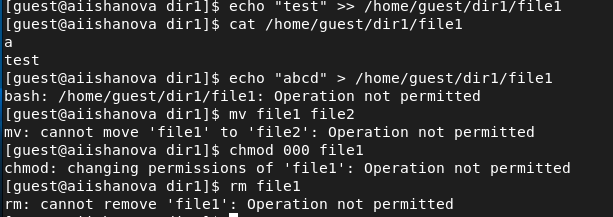
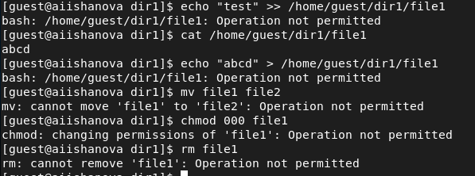

---
# Front matter
lang: ru-RU
title: "Лабораторная работа №4"
subtitle: "Дискреционное разграничение прав в Linux. Расширенные атрибуты."
author: "Ишанова А.И. группа НФИ-02-19"

# Formatting
toc-title: "Содержание"

# Pdf output format
toc: true # Table of contents
toc_depth: 2
lof: true # List of figures
lot: false # List of tables
fontsize: 12pt
linestretch: 1.5
papersize: a4
documentclass: scrreprt
## I18n
polyglossia-lang:
  name: russian
  options:
	- spelling=modern
	- babelshorthands=true
polyglossia-otherlangs:
  name: english
### Fonts
mainfont: PT Serif
romanfont: PT Serif
sansfont: PT Sans
monofont: PT Mono
mainfontoptions: Ligatures=TeX
romanfontoptions: Ligatures=TeX
sansfontoptions: Ligatures=TeX,Scale=MatchLowercase
monofontoptions: Scale=MatchLowercase,Scale=0.9
## Biblatex
biblatex: true
biblio-style: "gost-numeric"
biblatexoptions:
  - parentracker=true
  - backend=biber
  - hyperref=auto
  - language=auto
  - autolang=other*
  - citestyle=gost-numeric
## Misc options
indent: true
header-includes:
  - \linepenalty=10 # the penalty added to the badness of each line within a paragraph (no associated penalty node) Increasing the value makes tex try to have fewer lines in the paragraph.
  - \interlinepenalty=0 # value of the penalty (node) added after each line of a paragraph.
  - \hyphenpenalty=50 # the penalty for line breaking at an automatically inserted hyphen
  - \exhyphenpenalty=50 # the penalty for line breaking at an explicit hyphen
  - \binoppenalty=700 # the penalty for breaking a line at a binary operator
  - \relpenalty=500 # the penalty for breaking a line at a relation
  - \clubpenalty=150 # extra penalty for breaking after first line of a paragraph
  - \widowpenalty=150 # extra penalty for breaking before last line of a paragraph
  - \displaywidowpenalty=50 # extra penalty for breaking before last line before a display math
  - \brokenpenalty=100 # extra penalty for page breaking after a hyphenated line
  - \predisplaypenalty=10000 # penalty for breaking before a display
  - \postdisplaypenalty=0 # penalty for breaking after a display
  - \floatingpenalty = 20000 # penalty for splitting an insertion (can only be split footnote in standard LaTeX)
  - \raggedbottom # or \flushbottom
  - \usepackage{float} # keep figures where there are in the text
  - \floatplacement{figure}{H} # keep figures where there are in the text
---

# Цель работы

Получение практических навыков работы в консоли с расширенными атрибутами файлов.

# Теоретическое введение

Дискреционное разграничение доступа — управление доступом субъектов к объектам на основе списков управления доступом или матрицы доступа. Также используются названия дискреционное управление доступом, контролируемое управление доступом и разграничительное управление доступом. [2]

## Атрибут "a" (append only)

Файл с установленным атрибутом «a» можно открыть только в режиме добавления для записи. Только суперпользователь или процесс, обладающий возможностью CAP_LINUX_IMMUTABLE, может установить или очистить этот атрибут. [3]

## Атрибут "i" (immutable)

Файл с атрибутом «i» не может быть изменён: его нельзя удалить или переименовать, нельзя создать ссылку на этот файл, большую часть метаданных файла нельзя изменить, и файл нельзя открыть в режиме записи. Только суперпользователь или процесс, обладающий возможностью CAP_LINUX_IMMUTABLE, может установить или очистить этот атрибут. [3]

# Выполнение лабораторной работы

1. От имени пользователя guest определили расширенные атрибуты файла. (@fig:001)

2. Установили командой chmod на файл file1 права, разрешающие чтение и запись для владельца файла. (@fig:001)

3. Получили отказ на установление расширенного атрибута на file1 от лица guest. (@fig:001)

{ #fig:001 width=70%}

4. Устанавливили расширенные атрибуты на file1 от лица суперпользователя. (@fig:002)

{ #fig:002 width=70%}

5. Пользователем guest проверили установку прав на file1. (@fig:003)

{ #fig:003 width=70%}

6. Ввели команду дозаписи и команду чтения. (@fig:004)

7. Попробовали перезаписать, удалить и переименовать файл. (@fig:004)

8. Попробовали поменять права на файл. (@fig:004)

{ #fig:004 width=70%}

9. Cняли расширенный атрибут. (@fig:005)

{ #fig:005 width=70%}

10. Повторили взаимодействия с файлом. (@fig:006)

{ #fig:006 width=70%}

11. Установили расширенный атрибут "i".  (@fig:007)

{ #fig:007 width=70%}

12. Повторили взаимодействия с файлом. (@fig:008)

{ #fig:008 width=70%}

13. Составили таблицу для сравнения результатов взаимодействий с file1 при разных расширенных атрибутах.

|Операции|Без расширенных атрибутов|Атрибут "a"|Атрибут "i"|
|:-------: |:------:| :------:| :------:|
|Дозапись в файл|+|+|-|
|Чтение файла|+|+|+|
|Переписывание файла|+|-|-|
|Удаление файла|+|-|-|
|Переименование файла|+|-|-|
|Изменение прав|+|-|-|

# Вывод

В ходе выполнения лабораторной работы были опробованы действие на практике расширенных атрибутов «а» и «i» и наблюдения был представлены ввиде таблицы.

# Библиография

1. Методические материалы курса.
2. Wikipedia: Избирательное управление доступом. (URL: https://ru.wikipedia.org/wiki/%D0%98%D0%B7%D0%B1%D0%B8%D1%80%D0%B0%D1%82%D0%B5%D0%BB%D1%8C%D0%BD%D0%BE%D0%B5_%D1%83%D0%BF%D1%80%D0%B0%D0%B2%D0%BB%D0%B5%D0%BD%D0%B8%D0%B5_%D0%B4%D0%BE%D1%81%D1%82%D1%83%D0%BF%D0%BE%D0%BC)
3. Атрибуты файлов в Linux (URL: https://zalinux.ru/?p=6440)
