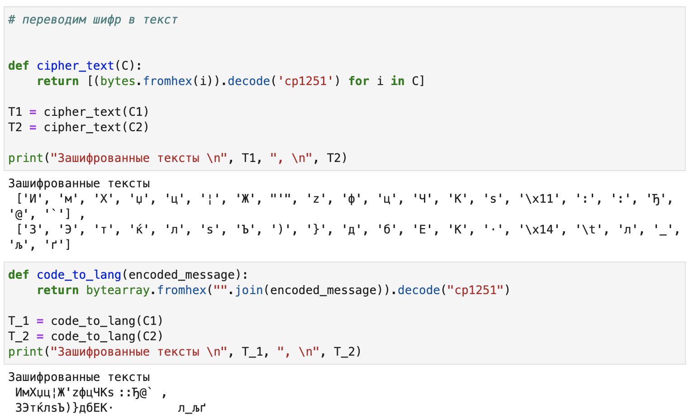
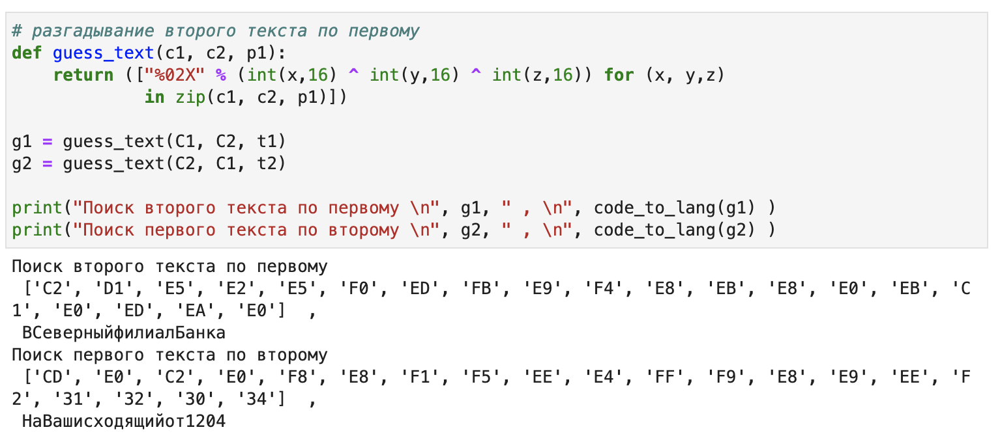

---
# Front matter
lang: ru-RU
title: "Лабораторная работа №8."
subtitle: "Элементы криптографии. Шифрование (кодирование) различных исходных текстов одним ключом."
author: "Ишанова А.И. группа НФИ-02-19"

# Formatting
toc-title: "Содержание"

# Pdf output format
toc: true # Table of contents
toc_depth: 2
lof: true # List of figures
lot: false # List of tables
fontsize: 12pt
linestretch: 1.5
papersize: a4
documentclass: scrreprt
## I18n
polyglossia-lang:
  name: russian
  options:
	- spelling=modern
	- babelshorthands=true
polyglossia-otherlangs:
  name: english
### Fonts
mainfont: PT Serif
romanfont: PT Serif
sansfont: PT Sans
monofont: PT Mono
mainfontoptions: Ligatures=TeX
romanfontoptions: Ligatures=TeX
sansfontoptions: Ligatures=TeX,Scale=MatchLowercase
monofontoptions: Scale=MatchLowercase,Scale=0.9
## Biblatex
biblatex: true
biblio-style: "gost-numeric"
biblatexoptions:
  - parentracker=true
  - backend=biber
  - hyperref=auto
  - language=auto
  - autolang=other*
  - citestyle=gost-numeric
## Misc options
indent: true
header-includes:
  - \linepenalty=10 # the penalty added to the badness of each line within a paragraph (no associated penalty node) Increasing the value makes tex try to have fewer lines in the paragraph.
  - \interlinepenalty=0 # value of the penalty (node) added after each line of a paragraph.
  - \hyphenpenalty=50 # the penalty for line breaking at an automatically inserted hyphen
  - \exhyphenpenalty=50 # the penalty for line breaking at an explicit hyphen
  - \binoppenalty=700 # the penalty for breaking a line at a binary operator
  - \relpenalty=500 # the penalty for breaking a line at a relation
  - \clubpenalty=150 # extra penalty for breaking after first line of a paragraph
  - \widowpenalty=150 # extra penalty for breaking before last line of a paragraph
  - \displaywidowpenalty=50 # extra penalty for breaking before last line before a display math
  - \brokenpenalty=100 # extra penalty for page breaking after a hyphenated line
  - \predisplaypenalty=10000 # penalty for breaking before a display
  - \postdisplaypenalty=0 # penalty for breaking after a display
  - \floatingpenalty = 20000 # penalty for splitting an insertion (can only be split footnote in standard LaTeX)
  - \raggedbottom # or \flushbottom
  - \usepackage{float} # keep figures where there are in the text
  - \floatplacement{figure}{H} # keep figures where there are in the text
---

# Цель работы

Освоить на практике применение режима однократного гаммирования на примере кодирования различных исходных текстов одним ключом.

# Теоретическое введение

Гамми́рование, или Шифр XOR, — метод симметричного шифрования, заключающийся в «наложении» последовательности, состоящей из случайных чисел, на открытый текст. Последовательность случайных чисел называется гамма-последовательностью и используется для зашифровывания и расшифровывания данных. Суммирование обычно выполняется в каком-либо конечном поле. Например, в поле Галуа GF(2) суммирование принимает вид операции «исключающее ИЛИ (XOR)». [2]

## Теория к программе

Шифротексты двух телеграмм можно получить по формулам режима однократного гаммирования[1]:

$$

C_1 = P_1 + K ,
C_2 = P_2 + K

$$

где $P$ - исходное сообщение, $K$ - ключ, а оператор + подразумевает прямую сумму.

С учётом свойства операции XOR:

$$

1 + 1 = 0, 1 +0  = 1

$$

где оператор + подразумевает прямую сумму.

получаем:

$$

C_1 + C_2 = P_1 + K + P_2 + K = P_1 + P_2

$$

где оператор + подразумевает прямую сумму.

Из этого следует, что можно найти один текст по двум шифрам, зная другой:

$$

C_1 + C_2 + P_1 = P_1 + P_2 + P_1 = P_2

$$

где оператор + подразумевает прямую сумму.

# Выполнение лабораторной работы

1. Была реализована программа на Python:

```python
# исходные данные
P1 = 'НаВашисходящийот1204'
P2 = 'ВСеверныйфилиалБанка'
K = ['{:02X}'.format(0x05), '{:02X}'.format(0x0C), 
     '{:02X}'.format(0x17), '{:02X}'.format(0x7F),
     '{:02X}'.format(0x0E), '{:02X}'.format(0x4E),
     '{:02X}'.format(0x37), '{:02X}'.format(0xD2),
     '{:02X}'.format(0x94), '{:02X}'.format(0x10),
     '{:02X}'.format(0x09), '{:02X}'.format(0x2E), 
     '{:02X}'.format(0x22), '{:02X}'.format(0x57), 
     '{:02X}'.format(0xFF), '{:02X}'.format(0xC8), 
     '{:02X}'.format(0x0B), '{:02X}'.format(0xB2), 
     '{:02X}'.format(0x70), '{:02X}'.format(0x54)]
print("Тексты:", P1, ", ", P2)
print("Ключ Центра:", K)

# перевод текста в hex
def to_hex(text):
    return [(i.encode('cp1251')).hex().upper() for i in text]

t1 = to_hex(P1)
t2 = to_hex(P2)
print("Тексты в hex \n", t1, ", \n", t2)

# кодируем строку с помощью ключа

def encode_message(hex_message, key):
    return (["%02X" % (int(x,16) ^ int(y,16)) for (x, y) in zip(hex_message, key)])

C1 = encode_message(t1, K)
C2 = encode_message(t2, K)

print("Зашифрованные тексты в hex \n", C1, ", \n", C2)

# переводим шифр в текст


def cipher_text(C):
    return [(bytes.fromhex(i)).decode('cp1251') for i in C]

T1 = cipher_text(C1)
T2 = cipher_text(C2)

print("Зашифрованные тексты \n", T1, ", \n", T2)

def code_to_lang(encoded_message):
    return bytearray.fromhex("".join(encoded_message)).decode("cp1251")

T_1 = code_to_lang(C1)
T_2 = code_to_lang(C2)
print("Зашифрованные тексты \n", T_1, ", \n", T_2)

# разгадывание второго текста по первому
def guess_text(c1, c2, p1):
    return (["%02X" % (int(x,16) ^ int(y,16) ^ int(z,16)) for (x, y,z) 
             in zip(c1, c2, p1)])

g1 = guess_text(C1, C2, t1)
g2 = guess_text(C2, C1, t2)

print("Поиск второго текста по первому \n", g1, " , \n", code_to_lang(g1) )
print("Поиск первого текста по второму \n", g2, " , \n", code_to_lang(g2) )


```

2. Запустили программу. Получили:

- телеграммы в hex

['CD', 'E0', 'C2', 'E0', 'F8', 'E8', 'F1', 'F5', 'EE', 'E4', 'FF', 'F9', 'E8', 'E9', 'EE', 'F2', '31', '32', '30', '34']

['C2', 'D1', 'E5', 'E2', 'E5', 'F0', 'ED', 'FB', 'E9', 'F4', 'E8', 'EB', 'E8', 'E0', 'EB', 'C1', 'E0', 'ED', 'EA', 'E0']

- закодированные телеграммы

['C8', 'EC', 'D5', '9F', 'F6', 'A6', 'C6', '27', '7A', 'F4', 'F6', 'D7', 'CA', 'BE', '11', '3A', '3A', '80', '40', '60']

['C7', 'DD', 'F2', '9D', 'EB', 'BE', 'DA', '29', '7D', 'E4', 'E1', 'C5', 'CA', 'B7', '14', '09', 'EB', '5F', '9A', 'B4']

- закодированные телеграммы в виде текста  (@fig:001)

{ #fig:001 width=100%}

- ключ для расшифровки

['7a', 'f1', '5b', '3e', 'ea', 'd', '9e', '23', 'd6', '3e', '40', 'd9', 'de', '6b', 'd8', '9b', 'b', '4f', '3a', '6e', '14', 'eb']

- сообщение, раскодированное ключом для расшифровки

['4d', '7', '3e', 'a5', 'bb', 'fb', '73', 'e2', 'dd', '41', '59', '5d', '64', 'c7', '5a', '1f', '6', 'c6', '61', 'e5', '35', '57']

- раскодированные телеграмм (@fig:002)

{ #fig:002 width=100%}

# Вывод

В ходе выполнения лабораторной работы было изучено шифрование методом однократного гаммирования на примере кодирования различных исходных текстов одним ключом и реализована программа на python, шифрующая и расшифровавующая два текста одним ключом, и расшифровывающая их без ключа, по одному из текстов.

# Библиография

1. Методические материалы курса.
2. Wikipedia: Гаммирование (URL: https://ru.wikipedia.org/wiki/%D0%93%D0%B0%D0%BC%D0%BC%D0%B8%D1%80%D0%BE%D0%B2%D0%B0%D0%BD%D0%B8%D0%B5)
